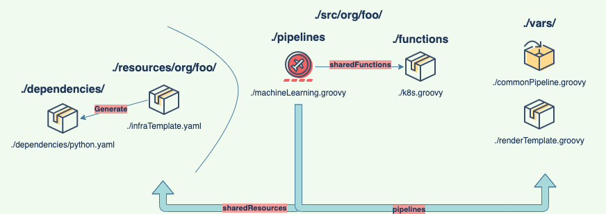

### Architecture diagram

helm repo add bitnami https://charts.bitnami.com/bitnami
helm install my-release bitnami/jenkins

kgsec my-release-jenkins -oyaml -ojsonpath='{.data.jenkins-password}' | base64 -D
helm upgrade -i my-release --set persistence.existingClaim=jenkins-pv-claim --set volumePermissions.enabled=true bitnami/jenkins

Kubernetes:
    1. kaf ~/Repos/private/jenkins-shared-library/cluster-role-binding.yaml
    2. k create serviceaccount jenkins

Github:
    1. Create a personal token: https://github.com/settings/tokens
    1.1 Note: Jenkins. Scope: repo.

Jenkins:
    1. Add credentials: http://localhost:8080/credentials/store/system/domain/_/
    1.1 Username: github user
    1.2 Password: github token from previous step
    1.3 ID: github
    1.4 Description: github

Jenkins:
New Item -> Organization Folder
Owner: naturalett
Behaviours:
    1. Repositories: Filter by name (with regular expression)
    2. Within repository: Discover branches, Discover pull requests from origin
Add the pipeline libraries
    3. Choose the credentials from the previous step
    4. Run the job:
    4.1 Approve scripts: 
    signature : new groovy.text.StreamingTemplateEngine
    method groovy.text.TemplateEngine createTemplate java.lang.String
    method groovy.text.Template make java.util.Map
    method groovy.lang.GroovyObject getMetaClass
    method groovy.lang.MetaObjectProtocol respondsTo java.lang.Object java.lang.String
    5. Add kubernetes cloud agent: http://localhost:8080/configureClouds/
    5.1 Install plugins: http://localhost:8080/pluginManager/available?filter=Cloud+Providers
    5.1.1 Install (Go to advanced):
        kubernetes-client: https://updates.jenkins.io/download/plugins/kubernetes-credentials/0.9.0/kubernetes-credentials.hpi
        kubernetes-credentials: https://updates.jenkins.io/download/plugins/kubernetes-credentials-provider/0.18-1/kubernetes-credentials-provider.hpi
        metrics: https://updates.jenkins.io/download/plugins/metrics/4.1.6.2/metrics.hpi
        kubernetes: https://updates.jenkins.io/download/plugins/kubernetes/3622.va_9dc5592b_10c/kubernetes.hpi

    Add kubernetes cloud agent: http://localhost:8080/configureClouds/
    Kubernetes cloud details:
        Kubernetes urls: https://kubernetes.default
        Kubernetes namespace: default
        Jenkins url: http://localhost:80
        Jenkins tunnel: jenkins-agent:50000
        Add pod labels:
            key: jenkins/jenkins-jenkins-slave
            value: true
        Pod template:
            Advanced -> Add Pod Template:
                name: default
                Pod template details:
                    labels: jenkins-jenkins-slave
                    Usage: use this node as much as possible
                Containers -> Add container:
                    name: jnlp
                    Docker image: jenkins/inbound-agent:4.3-4
                    Arguments to pass to the command: ${computer.jnlpmac} ${computer.name}
                Environment variable -> to add:
                    key: JENKINS_URL
                    value: http://jenkins.jenkins.svc.cluster.local:80/
